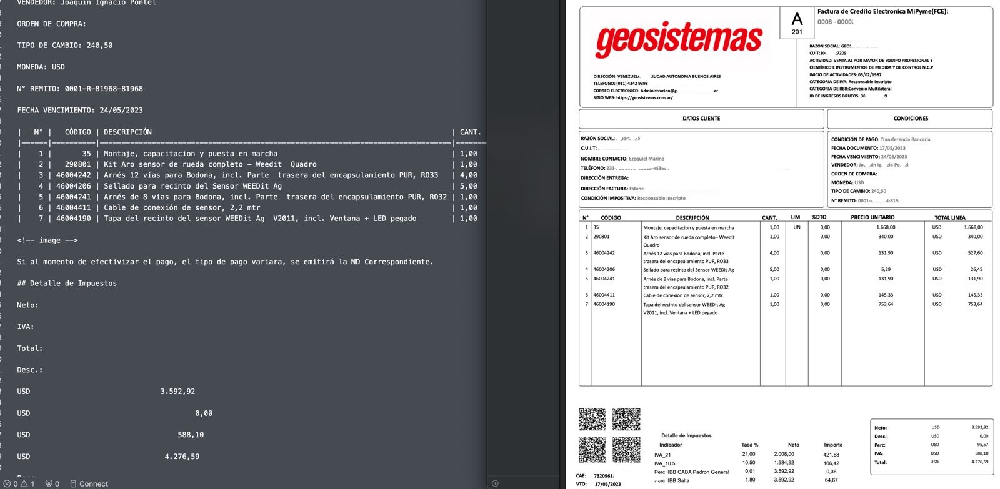

# OpenAI-API Structured Outputs

<a target="_blank" href="https://cookiecutter-data-science.drivendata.org/">
    
</a>

Extrae datos estructurados de documentos PDF utilizando [Docling](https://github.com/docling-project/docling/) para el parsing y la API de OpenAI con [Structured Outputs](https://platform.openai.com/docs/guides/structured-outputs) para organizar la información en bases de datos limpias.



<a target="_blank" href="https://github.com/docling-project/docling/">
    
</a>

## Funcionalidades

- Conversión de PDF a Markdown usando Docling
- Extracción de datos estructurados via OpenAI API con modelos Pydantic
- Sistema de cache para evitar reprocesar archivos (hash SHA-256)
- Exportación a Excel con múltiples hojas organizadas
- Soporte para procesamiento batch de directorios

## Caso de Uso: Extracción de CVs

El proyecto incluye un pipeline completo para extraer información de currículums vitae:

- **Candidatos**: Datos personales, contacto, resumen
- **Experiencia**: Historial laboral con fechas y responsabilidades
- **Educación**: Formación académica
- **Habilidades**: Skills técnicos y blandos con nivel
- **Certificaciones**: Cursos y certificados

## Instalación

### Requisitos previos

- Python 3.10+
- Conda (recomendado) o pip
- API Key de OpenAI

### Setup

```bash
# Crear entorno conda
make create_environment
conda activate openai-api

# Instalar dependencias
make requirements

# Configurar API key
echo "OPENAI_API_KEY=tu-api-key" > .env
```

## Uso

### Extracción de CVs

```bash
python notebooks/extract_cv_data.py
```

El script:
1. Busca archivos PDF en el directorio configurado
2. Verifica si ya fueron procesados (cache de hashes)
3. Convierte cada PDF a Markdown con Docling
4. Envía el contenido a OpenAI para extracción estructurada
5. Agrega los datos al archivo Excel de salida

### Forzar reprocesamiento

Para reprocesar archivos ya procesados, modificar el parámetro `force=True` en la llamada a `process_pdf()`.

## Estructura del Proyecto

```
├── notebooks/                  # Scripts de extracción
│   ├── extract_cv_data.py      # Pipeline principal de CVs
│   ├── extract_cv_data.ipynb   # Versión notebook
│   └── extract_invoice_data.ipynb  # Extracción de facturas
├── src/                        # Módulos de soporte
│   └── config.py               # Configuración de paths
├── reports/figures/            # Imágenes para documentación
├── Makefile                    # Automatización de tareas
├── requirements.txt            # Dependencias pip
├── pyproject.toml              # Configuración del proyecto
└── setup.cfg                   # Configuración de linters
```

## Desarrollo

```bash
# Formatear código
make format

# Verificar estilo
make lint

# Limpiar archivos temporales
make clean
```

## Dependencias Principales

| Librería | Uso |
|----------|-----|
| [docling](https://github.com/docling-project/docling/) | Conversión PDF a Markdown |
| [openai](https://github.com/openai/openai-python) | API client con structured outputs |
| [pydantic](https://docs.pydantic.dev/) | Validación y esquemas de datos |
| [pandas](https://pandas.pydata.org/) | Manipulación de datos |
| [openpyxl](https://openpyxl.readthedocs.io/) | Lectura/escritura de Excel |

## Configuración

El proyecto usa variables de entorno para configuración sensible:

| Variable | Descripción |
|----------|-------------|
| `OPENAI_API_KEY` | API key de OpenAI (requerida) |

Crear archivo `.env` en la raíz del proyecto con las variables necesarias.

## Licencia

Este proyecto está bajo la licencia MIT.
